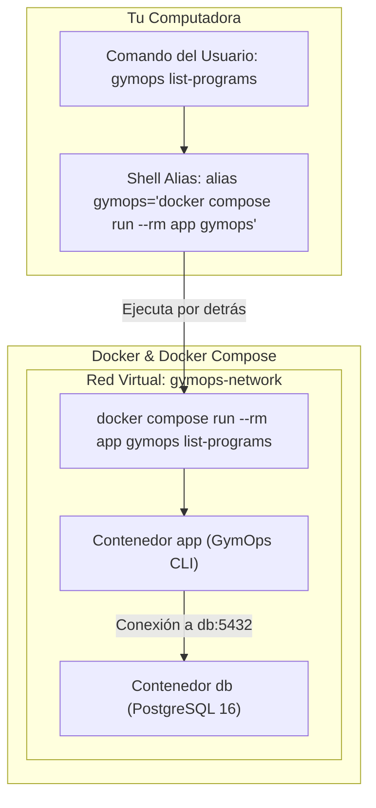

# 🚀 Plan de Implementación: Docker & Docker Compose para GymOps 

## 📌 Objetivo
Containerizar la aplicación **GymOps** (CLI en Python 3.12) y su backend **PostgreSQL 16** utilizando **Docker** y **Docker Compose**, integrando además el **Método del Alias** para que puedas usar el comando corto `gymops` directamente en tu terminal sin necesidad de escribir comandos largos de Docker.

Esta implementación busca:
1. **Valor para CV / Resume:** Demostrar competencias de **DevOps** (Containerización, Multi-container Orchestration, Redes virtuales de Docker, Persistencia con Volúmenes, Healthchecks, Aliases de shell y variables de entorno).
2. **Experiencia de instalación en 1 Comando ("One-Command Setup"):** Permitir que cualquier persona o reclutador ejecute todo el sistema con `docker compose up -d`.
3. **Flujo de Usuario Transparente (Método del Alias):** Configurar y documentar un atajo de shell (`alias gymops="docker compose run --rm app gymops"`) para que usar la app dockerizada se sienta 100% nativo.

---

## ❓ ¿Por qué y Cómo funciona el Método del Alias?

### 1. ¿Por qué usamos un Alias?
Normalmente, ejecutar un comando en un servicio Dockerizado requiere escribir:
```bash
docker compose run --rm app gymops list-programs
```
Escribir esa instrucción cada vez resulta largo e incómodo. 

Un **alias** es un atajo de tu shell (bash/zsh) que mapea la palabra `gymops` a ese comando largo. De esta forma, tú solo escribes:
```bash
gymops list-programs
```
Y tu terminal ejecuta la versión de Docker por detrás.

### 2. ¿Cómo funciona la arquitectura con Alias?



---

## 🛠️ ¿Quién hace qué? (Agente vs. Usuario)

> [!IMPORTANT]
> **El agente (IA):**
> 1. Creará la infraestructura completa de Docker (`Dockerfile`, `.dockerignore`, `docker-compose.yml`, `.env.example`).
> 2. Probará automáticamente la construcción y ejecución de la base de datos y la aplicación CLI dentro de Docker.
> 3. Creará un script auxiliar `gymops-docker.sh` y documentará la configuración del alias en el `README.md`.
>
> **Tú (Usuario):**
> Solamente debes copiar la línea del alias en tu terminal o archivo de configuración (`~/.bashrc` o `~/.zshrc`) para hacer el atajo permanente si deseas usarlo siempre.

---

## 🔍 Cambios Propuestos

### 1. Infraestructura Docker

#### [NEW] `Dockerfile`
Imagen ligera `python:3.12-slim` con `uv` preinstalado.

```dockerfile
FROM python:3.12-slim

ENV PYTHONUNBUFFERED=1 \
    PYTHONDONTWRITEBYTECODE=1 \
    GYMOPS_DB_HOST=db

WORKDIR /app

COPY --from=ghcr.io/astral-sh/uv:latest /uv /uvx /bin/
COPY pyproject.toml uv.lock README.md ./
RUN uv pip install --system -e .

COPY gymops/ gymops/
COPY proyecto_bdII/ proyecto_bdII/

ENTRYPOINT ["gymops"]
CMD ["--help"]
```

#### [NEW] `.dockerignore`
Exclusión de caché y archivos innecesarios.

#### [NEW] `docker-compose.yml`
Orquestación de los servicios `db` (PostgreSQL 16) y `app` (CLI GymOps) con salud e integridad.

```yaml
services:
  db:
    image: postgres:16-alpine
    container_name: gymops-db
    restart: unless-stopped
    environment:
      POSTGRES_USER: gymops
      POSTGRES_PASSWORD: gymops_pass
      POSTGRES_DB: gymops_db
    ports:
      - "5432:5432"
    volumes:
      - gymops_pgdata:/var/lib/postgresql/data
    healthcheck:
      test: ["CMD-SHELL", "pg_isready -U gymops -d gymops_db"]
      interval: 5s
      timeout: 5s
      retries: 5

  app:
    build: .
    container_name: gymops-app
    environment:
      GYMOPS_DB_HOST: db
      GYMOPS_DB_PORT: 5432
      GYMOPS_DB_USER: gymops
      GYMOPS_DB_PASSWORD: gymops_pass
      GYMOPS_DB_NAME: gymops_db
    depends_on:
      db:
        condition: service_healthy
    tty: true
    stdin_open: true

volumes:
  gymops_pgdata:
```

#### [NEW] `gymops-docker.sh`
Script ejecutable auxiliar de 1 línea para quienes deseen usar el atajo sin modificar manualmente sus archivos de shell.

```bash
#!/usr/bin/env bash
docker compose run --rm app gymops "$@"
```

#### [NEW] `.env.example`
Plantilla de variables de entorno para configuración.

---

### 2. Documentación

#### [MODIFY] `README.md`
- Añadir badges de **DevOps (Docker & Docker Compose)**.
- Explicar paso a paso la configuración del **Método del Alias**:
  ```bash
  # Agregar el alias a tu terminal actual:
  alias gymops="docker compose run --rm app gymops"
  
  # O guardarlo permanentemente en tu ~/.bashrc:
  echo 'alias gymops="docker compose run --rm app gymops"' >> ~/.bashrc
  source ~/.bashrc
  ```
- Explicar el uso fluido con `gymops list-programs`, `gymops sessions`, etc.

---

## 🧪 Plan de Verificación

### 1. Verificación Automática (Agente)
1. Construir la imagen Docker: `docker compose build`.
2. Levantar la base de datos: `docker compose up -d db`.
3. Validar estado con `docker compose ps`.
4. Ejecutar comandos GymOps desde el contenedor:
   - `docker compose run --rm app gymops list-programs`
   - `docker compose run --rm app gymops set-day "Upper A — Strength"`
   - `docker compose run --rm app gymops log --exercise "Barbell Bench Press" --sets 4 --reps 5 --weight 80`
   - `docker compose run --rm app gymops sessions`
5. Probar el script auxiliar `./gymops-docker.sh list-programs`.

### 2. Verificación por el Usuario
- Probar el alias en tu terminal ejecutando `gymops list-programs`.

---

## 📄 Resumen de Entregables
- [x] Documento de plan actualizado: `PLANNING_DOCKER.md`
- [x] `Dockerfile`
- [x] `.dockerignore`
- [x] `docker-compose.yml`
- [x] `gymops-docker.sh`
- [x] `.env.example`
- [x] `README.md` actualizado con Método del Alias y DevOps
