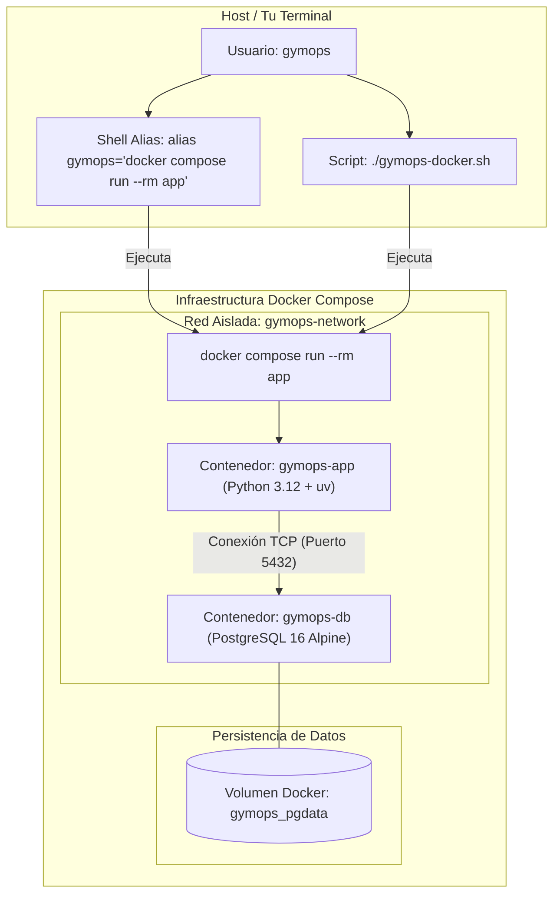

# GymOps 🏋️

[](https://www.docker.com/)
[](https://docs.docker.com/compose/)
[](https://www.postgresql.org/)
[](https://www.python.org/)
[](https://github.com/astral-sh/uv)

> Herramienta de seguimiento de entrenamiento para la terminal (CLI) con arquitectura **Database-First** basada en **PostgreSQL 16** y **Python 3.12**, totalmente containerizada con **Docker & Docker Compose**.

> [!IMPORTANT]
> **Enfoque técnico y arquitectura.** GymOps es una aplicación CLI completa donde toda la lógica de negocio (cálculo de 1RM, detección automática de Récords Personales, auditoría JSONB, control de sobrecarga progresiva y validaciones) está delegada directamente en PostgreSQL mediante **procedimientos almacenados, triggers, funciones UDF y vistas optimizadas**. La capa de aplicación en Python (`Typer` + `psycopg2`) actúa como una interfaz de presentación limpia sin ORMs intermedios.

### ¿A quién va dirigido?
GymOps está diseñado principalmente para:
- **Estudiantes de Ingeniería Informática** y entusiastas de la tecnología familiarizados con la terminal. El uso de interfaces CLI/TUI es ideal por su compatibilidad con agentes de Inteligencia Artificial que pueden interactuar directamente con la terminal para automatizar tareas.
- **Principiantes y entusiastas del fitness** que desean comenzar a entrenar fuerza en el gimnasio o mediante otras modalidades. Ofrece la flexibilidad de registrar manualmente cualquier ejercicio (haciéndolo útil incluso para calistenia u otras disciplinas).

### Entrena con Ciencia
El sistema recopila información y principios de entrenamiento basados en la ciencia. GymOps viene precargado con splits conocidos y recomendados por su efectividad, científicamente estructurados. El usuario puede:
1. Revisar las rutinas disponibles.
2. Seleccionar la que mejor se adapte a su disponibilidad de tiempo y preferencias.
3. Seguir de forma guiada los ejercicios, series y repeticiones recomendados para optimizar sus resultados.


---

## ¿Para quién es GymOps?

| Perfil | Cómo lo ayuda GymOps |
|--------|----------------------|
| 🔰 **Sin experiencia** | Viene precargado con splits conocidos y recomendados por su efectividad. Solo elige la tuya y empieza a registrar. |
| 📈 **Intermedio** | Lleva el seguimiento de tus cargas, detecta si estás progresando y rompe tus PRs. |
| ⚙️ **Avanzado** | Crea tus propios programas y rutinas personalizadas desde la CLI. |

---

## Características

- **Containerización completa**: Todo el entorno (app + BD) orquestado con Docker y Docker Compose.
- **Rutinas listas para usar**: Viene precargado con splits conocidos y recomendados por su efectividad (Upper/Lower 4 días, ULPPL 5 días, PPL 6 días). Ideal para quienes no saben qué rutina hacer.
- **Programas personalizados**: Crea tus propios programas y días de entrenamiento desde la CLI.
- **Backend PostgreSQL**: Base de datos relacional completa con procedimientos almacenados, vistas, triggers e índices.
- **1RM estimado**: Calcula el máximo estimado de una repetición usando la fórmula de Epley después de cada serie.
- **Estadísticas de sobrecarga progresiva**: Compara el rendimiento de hoy contra tu última sesión para saber si estás mejorando.
- **Seguimiento de PRs**: Detecta y registra tus récords personales automáticamente.
- **Auditoría automática**: Todo cambio en sets y PRs queda registrado en un log de auditoría.
- **Resúmenes semanales**: Genera resúmenes en Markdown del volumen semanal de entrenamiento y mejores levantamientos.
- **CLI bilingüe**: Cambia entre inglés y español con `gymops set-language`.

---

## Inicio rápido

### Requisitos previos
- [Docker](https://docs.docker.com/get-docker/) y Docker Compose

---

### Opción 1: Docker & Docker Compose (Recomendado — One-Command Setup)

Esta opción containeriza tanto la base de datos PostgreSQL como la aplicación CLI, garantizando que el entorno funcione exactamente igual en cualquier máquina sin necesidad de configurar Python ni dependencias locales.

```bash
# 1. Clonar el repositorio
git clone https://github.com/Pierorivera1/GymOps.git
cd GymOps

# 2. Iniciar la base de datos PostgreSQL en segundo plano
docker compose up -d db

# 3. (Recomendado) Configurar el Alias para uso nativo en tu terminal
alias gymops="docker compose run --rm app"

# Para hacerlo permanente en tu terminal (Bash / Zsh):
echo 'alias gymops="docker compose run --rm app"' >> ~/.bashrc
source ~/.bashrc

# 4. ¡Listo! Ejecuta cualquier comando GymOps directamente
gymops --help
gymops list-programs
```

> [!TIP]
> **¿Prefieres no crear un alias?** Puedes usar directamente el script auxiliar incluido:
> ```bash
> ./gymops-docker.sh list-programs
> ./gymops-docker.sh --help
> ```

---

### Opción 2: Instalación Local con `uv` (Desarrollo nativo)

Si deseas desarrollar o modificar el código fuente de Python directamente en tu máquina host:

```bash
# 1. Iniciar la base de datos PostgreSQL con Docker
docker compose up -d db

# 2. Crear entorno virtual e instalar dependencias con uv
uv venv
source .venv/bin/activate
uv pip install -e .

# 3. Verificar funcionamiento
gymops --help
```

---

## 🐳 Arquitectura Docker & DevOps

GymOps implementa un entorno de microservicios contenerizado bajo las mejores prácticas de la industria:



### Principios de DevOps implementados:
1. **Multi-Stage / Fast Build con `uv`**: Uso de la imagen oficial de `uv` en `Dockerfile` con `python:3.12-slim` para instalaciones de dependencias en segundos.
2. **Healthchecks automáticos**: El servicio `db` implementa un healthcheck con `pg_isready`. El servicio `app` espera automáticamente a que PostgreSQL esté 100% saludable antes de lanzar cualquier comando.
3. **Persistencia desacoplada**: Los datos de entrenamiento, rutinas y registros de auditoría residen en el volumen persistente `gymops_pgdata`, sobreviviendo al apagado o reinicio de contenedores.
4. **Contenedores efímeros con `--rm`**: Cada comando CLI se ejecuta en un contenedor temporal interactivo (`tty: true`, `stdin_open: true`) que se destruye al finalizar, evitando el consumo innecesario de memoria en el host.
5. **Aislamiento de red**: Comunicación interna a través de un puente de red virtual (`gymops-network`).

### Comandos de gestión de Docker:

```bash
# Iniciar servicios en segundo plano
docker compose up -d db

# Ver el estado y healthcheck de los servicios
docker compose ps

# Ver logs de la base de datos en tiempo real
docker compose logs -f db

# Reconstruir la imagen de la aplicación tras cambios en código
docker compose build

# Detener los servicios
docker compose stop

# Eliminar contenedores manteniendo los datos del volumen
docker compose down

# Eliminar contenedores Y los volúmenes de datos (reset completo)
docker compose down -v
```

---

## Uso

```bash
# Establecer el idioma preferido (en / es)
gymops set-language es

# 1. Listar todos los programas de entrenamiento disponibles
gymops list-programs

# 2. Seleccionar el programa activo que seguirás
gymops select-program "Upper/Lower 4-Day"

# 3. Establecer el día de entrenamiento de hoy (hacerlo al inicio del entrenamiento)
gymops set-day "Upper A — Strength"

# 4. Registrar tus series mientras las realizas
gymops log --exercise "Barbell Bench Press" --sets 4 --reps 5 --weight 80

# 5. Revisar la sobrecarga progresiva vs la última sesión
gymops stats --exercise "Barbell Bench Press"

# 6. Ver tus récords personales
gymops prs

# 7. Ver el historial de un ejercicio
gymops history --exercise "Barbell Bench Press"

# 8. Agregar un ejercicio al catálogo
gymops add-exercise --name "Dumbbell Lateral Raise" --muscle-group "Shoulders" --type isolation

# 9. Crear un programa de entrenamiento personalizado
gymops add-program

# 10. Generar un resumen semanal en Markdown
gymops digest
```

### Comandos de análisis y reportes (consultan vistas, funciones y SPs)

```bash
# Resumen de sesiones recientes (vista v_session_summary)
gymops sessions

# Progresión de 1RM de un ejercicio en el tiempo (vista v_exercise_progress)
gymops progress --exercise "Barbell Bench Press"

# Volumen semanal por grupo muscular (vista v_muscle_volume_week / función fn_weekly_volume)
gymops muscle-volume
gymops muscle-volume --week 2026-06-22

# Catálogo de ejercicios con estadísticas de uso (vista v_exercise_catalog)
gymops list-exercises

# Estructura completa de un programa: días, ejercicios y objetivos (vista v_program_overview)
gymops show-program "Upper/Lower 4-Day"

# Línea de tiempo cronológica de todos los PRs (vista v_pr_timeline)
gymops pr-timeline

# Métricas completas de un ejercicio (procedimiento almacenado sp_get_exercise_stats)
gymops exercise-stats --exercise "Barbell Bench Press"
```

> Todos estos comandos consumen directamente objetos SQL del servidor. El mapeo completo comando → objeto SQL (con el código de cada vista, función, SP y trigger) está documentado por fase en el manual de usuario entregado al curso.

---

## Base de datos

GymOps corre sobre **PostgreSQL 16** (Docker). El esquema incluye:

| Objeto | Cantidad | Descripción |
|--------|----------|-------------|
| Tablas | 11 | Esquema relacional en 3FN (con desnormalización controlada por triggers) |
| Vistas | 9 (1 actualizable) | Reportes, seguridad y seguimiento de progreso |
| Índices | 15 | Índices B-tree, parciales y de expresión |
| Procedimientos almacenados | 5 `sp_*` + 2 `prc_*` (CALL) | Gestión de sesiones, log de sets, detección de PRs, mantenimiento |
| Funciones (UDF) | 6 | Fórmula Epley, volumen, historial por ejercicio |
| Triggers | 7 | Cálculo automático de 1RM, auditoría, validaciones, INSTEAD OF sobre vista |

### Scripts SQL (`proyecto_bdII/sql/`)

| Script | Propósito |
|--------|-----------|
| `01_ddl.sql` | Esquema: tablas, PKs, FKs, CHECKs |
| `02_seed.sql` | Datos iniciales: músculos, 51 ejercicios, 3 programas predeterminados |
| `03_dml.sql` | DML: sesiones, series, ejemplos de UPDATE/DELETE |
| `04_queries.sql` | 10 consultas avanzadas (CTE, funciones de ventana, RANK, LAG) |
| `05_views.sql` | 9 vistas para reportes y seguridad; `v_current_prs` actualizable vía trigger INSTEAD OF |
| `06_indexes.sql` | 15 índices + planes EXPLAIN ANALYZE |
| `07_procedures.sql` | 5 rutinas `sp_*` (FUNCTION/SELECT) + 2 procedimientos `prc_*` (PROCEDURE/CALL) |
| `08_functions.sql` | 6 funciones escalares y tipo tabla |
| `09_triggers.sql` | 6 triggers de auditoría, cálculo automático y validación |

### Modelo de datos (entidades principales)

| Entidad | Descripción |
|---------|-------------|
| `muscle_group` | Grupos musculares (pecho, espalda, piernas, hombros, etc.) |
| `exercise` | Catálogo maestro de ejercicios (nombre, músculo, tipo, equipamiento) |
| `program` | Programa de entrenamiento (ej: "Upper/Lower 4-Day") |
| `program_day` | Día dentro de un programa (ej: "Upper A — Strength") |
| `routine_exercise` | Ejercicios asignados a un día de programa (con series y reps objetivo) |
| `workout_session` | Sesión de entrenamiento realizada (fecha, programa y día) |
| `workout_set` | Set individual registrado (ejercicio, reps, peso, 1RM calculado) |
| `personal_record` | Récord personal por ejercicio (máximo 1RM histórico) |
| `audit_log` | Registro de auditoría de cambios en sets y PRs (JSONB) |
| `guide_article` | Guías y artículos de fitness (contenido en Markdown) |
| `active_program` | Tabla de control (fila única) con el programa y día activos |

### Diagrama de Entidades (ERD)

Notación: `1 ──< N` indica una relación uno-a-muchos (el lado `<` es el "muchos", donde vive la FK). Las flechas apuntan de la tabla hija (FK) a la tabla padre (PK).

```
                    program
                       ▲ 1
                       │
                       │ N
                  program_day ◄──────────────┐
                    ▲ 1     ▲ 1              │ N
                    │       │ N              │
                    │ N   workout_session    │
          routine_exercise    ▲ 1            │
                    │ N       │ N            │
                    │      workout_set       │
                    ▼ 1       │ N            │
   muscle_group ──< exercise ─┤             (workout_session.program_day_id)
        1        N   ▲ 1      │ N
                     │        ▼ 1
                     │   personal_record  (1:1 por ejercicio, vía UNIQUE)
                     │        │
                     └────────┘  (personal_record.exercise_id → exercise.id;
                                  personal_record.set_id → workout_set.id)

   audit_log         → tabla independiente, sin FKs (preserva el historial aunque
                       se borren registros de origen). Poblada por triggers.
   active_program     → tabla de control de fila única (program_id, day_id).
   guide_article      → tabla independiente de contenido informativo.
```

#### Relaciones e Integridad Referencial (`ON DELETE`)

| Tabla hija (FK) | Columna | Tabla padre | Regla ON DELETE | Descripción |
|-----------------|---------|-------------|-----------------|-------------|
| `exercise` | `muscle_group_id` | `muscle_group` | `RESTRICT` | No borra grupo si tiene ejercicios asociados |
| `program_day` | `program_id` | `program` | `CASCADE` | Borrar programa elimina sus días |
| `routine_exercise` | `program_day_id` | `program_day` | `CASCADE` | Borrar día elimina sus ejercicios prescritos |
| `routine_exercise` | `exercise_id` | `exercise` | `RESTRICT` | No borra ejercicio si está en rutinas |
| `workout_session` | `program_day_id` | `program_day` | `SET NULL` | Preserva historial si se borra el día |
| `workout_set` | `session_id` | `workout_session` | `CASCADE` | Borrar sesión elimina sus sets |
| `workout_set` | `exercise_id` | `exercise` | `RESTRICT` | No borra ejercicio si tiene sets registrados |
| `personal_record` | `exercise_id` | `exercise` | `CASCADE` | Récord se borra si se elimina el ejercicio |
| `personal_record` | `set_id` | `workout_set` | `SET NULL` | Mantiene el PR aunque se borre el set específico |

> Para un análisis exhaustivo del **Modelo Conceptual vs Modelo Físico** (con diagramas de arquitectura en imagen), consulta [`proyecto_bdII/MODELO_DATOS.md`](proyecto_bdII/MODELO_DATOS.md). Para el análisis de **Normalización en 3FN y Desnormalización Controlada**, consulta [`proyecto_bdII/DESCRIPCION_PROYECTO.md`](proyecto_bdII/DESCRIPCION_PROYECTO.md) §1.8.

### Conexión

```
Host:          localhost
Puerto:        5432
Base de datos: gymops_db
Usuario:       gymops
Contraseña:    gymops_pass
```

---

## Requerimientos

### Funcionales

| ID | Requerimiento |
|----|---------------|
| RF-01 | Registrar ejercicios con nombre, grupo muscular, tipo y equipamiento |
| RF-02 | Crear y gestionar programas de entrenamiento con días y ejercicios asignados |
| RF-03 | Iniciar y cerrar sesiones de entrenamiento |
| RF-04 | Registrar sets (ejercicio, series, reps, peso) dentro de una sesión |
| RF-05 | Calcular automáticamente el 1RM estimado por cada set (fórmula Epley) |
| RF-06 | Detectar y registrar récords personales automáticamente |
| RF-07 | Mostrar estadísticas de progreso comparando sesiones pasadas vs actuales |
| RF-08 | Generar reportes semanales de volumen y mejores levantamientos |
| RF-09 | Consultar el historial de cualquier ejercicio |
| RF-10 | Registrar un log de auditoría de cambios en sets y PRs |

### No Funcionales

| ID | Requerimiento |
|----|---------------|
| RNF-01 | **Rendimiento:** Consultas frecuentes (historial, PRs) en < 100ms con índices |
| RNF-02 | **Integridad:** Todas las relaciones con FK y ON DELETE apropiado |
| RNF-03 | **Disponibilidad:** BD en Docker disponible localmente en todo momento |
| RNF-04 | **Usabilidad:** Salida formateada con Rich tables para todas las consultas |
| RNF-05 | **Mantenibilidad:** Todo el código SQL comentado y organizado por archivo |
| RNF-06 | **Portabilidad:** Scripts SQL compatibles con PostgreSQL 14+ |
| RNF-07 | **Trazabilidad:** Todo cambio en `workout_set` y `personal_record` auditado |

---

## Alcance

**Incluido en esta versión:**
- Módulo de gestión de ejercicios (catálogo por músculo y tipo)
- Módulo de programas de entrenamiento (splits, días, rutinas predefinidas y personalizadas)
- Módulo de sesiones de entrenamiento (log de sets por sesión)
- Módulo de análisis de progreso (1RM estimado, sobrecarga progresiva, PRs)
- Módulo de reportes (resúmenes semanales, estadísticas por ejercicio)
- Implementación SQL completa: DDL, DML, vistas, índices, SPs, funciones, triggers

**Fuera de alcance en esta versión:**
- Módulo de Administración y Seguridad (gestión de usuarios/roles de BD, backups automáticos, GRANT/REVOKE)
- Interfaz web o móvil (la aplicación es CLI/TUI)
- Sincronización en la nube

---

## Estructura del proyecto

```
GymOps/
├── gymops/                       # Código fuente de la aplicación CLI
│   ├── cli.py                    # Todos los comandos Typer del CLI
│   ├── db.py                     # Capa de base de datos (PostgreSQL/psycopg2)
│   ├── i18n.py                   # Internacionalización (en / es)
│   ├── models.py                 # Dataclasses: Workout, Exercise, PR, Routine
│   └── report.py                 # Generador de resúmenes semanales
├── proyecto_bdII/                # Entregables y scripts SQL del proyecto
│   ├── DESCRIPCION_PROYECTO.md   # Documentación académica y reglas de negocio
│   ├── MODELO_DATOS.md           # Modelo conceptual, físico y diagramas ERD
│   └── sql/                      # Scripts SQL modulares (01_ddl.sql … 09_triggers.sql)
├── tests/                        # Suite de pruebas con pytest
├── .dockerignore                 # Exclusión de archivos en build context
├── .env.example                  # Plantilla de variables de entorno
├── docker-compose.yml            # Orquestación multi-contenedor (app + db)
├── Dockerfile                    # Definición de contenedor Python 3.12 + uv
├── gymops-docker.sh              # Script ejecutable auxiliar para Docker
├── pyproject.toml                # Metadatos del proyecto y dependencias
└── uv.lock                       # Lockfile reproducible de dependencias
```

---

## Desarrollo y pruebas

> [!NOTE]
> Dado que esta versión está enfocada en el desarrollo de la Base de Datos, las pruebas unitarias e integración no son parte del flujo regular de trabajo y solo deben ejecutarse de manera explícita si se requiere validar el comportamiento CLI.

```bash
# Instalar requisitos de prueba
uv pip install pytest

# Ejecutar pruebas (solo bajo demanda explícita)
uv run pytest
```

---

## Documentación Técnica de Arquitectura

Para una revisión detallada del diseño de la base de datos, decisiones de arquitectura y modelo relacional, consulta los siguientes documentos:

- 📐 [**Modelo de Datos (Conceptual vs Físico)**](proyecto_bdII/MODELO_DATOS.md): Diagramas visuales de entidad-relación, tipos de dato en PostgreSQL y políticas de borrado.
- 📋 [**Descripción del Proyecto**](proyecto_bdII/DESCRIPCION_PROYECTO.md): Especificación de requerimientos, reglas de negocio, justificación de normalización en 3FN y desnormalizaciones deliberadas.
- 🗄️ [**Scripts SQL en `proyecto_bdII/sql/`**](proyecto_bdII/sql/): Implementación modular DDL, DML, vistas, índices, Stored Procedures, UDFs y Triggers.

**Stack Tecnológico**: PostgreSQL 16 · Python 3.12 · Docker · Typer · Rich · psycopg2
