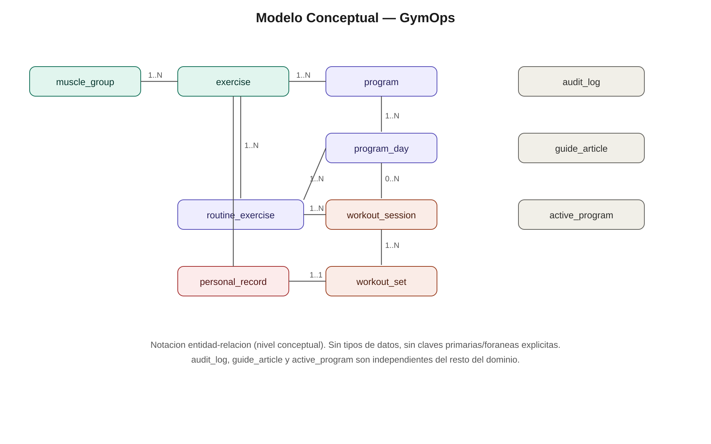
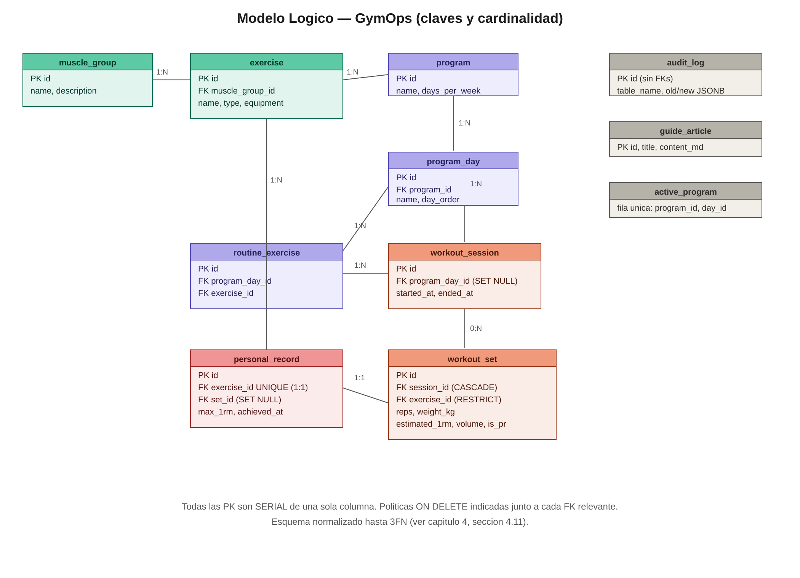

# GymOps — Modelo Conceptual y Modelo Físico

### Base de Datos II — UNFV
**Diagramas:** aportados por el equipo a partir del proyecto completo (`img/modelo_conceptual.png`, `img/modelo_logico.png`).

Este documento describe las dos vistas de diseño de datos que preceden a la implementación en `sql/01_ddl.sql`: el **modelo conceptual** (entidades y relaciones del negocio, sin detalle técnico) y el **modelo físico** (tablas reales con tipos de dato, claves y reglas de integridad tal como existen en PostgreSQL).

---

## 1. Modelo Conceptual

Representa el dominio del negocio — entrenamiento físico — en su forma más abstracta: entidades con nombre y las relaciones entre ellas, **sin** tipos de dato ni claves primarias/foráneas explícitas. Es el nivel pensado para validar el negocio con un no-técnico antes de bajar a diseño de tablas.

### 1.1 Entidades del dominio activo

| Entidad | Rol en el negocio |
|---|---|
| `muscle_group` | Catálogo de grupos musculares (pecho, espalda, piernas, etc.) |
| `exercise` | Catálogo maestro de ejercicios, clasificado por músculo |
| `program` | Programa de entrenamiento (split) |
| `program_day` | Día individual dentro de un programa |
| `routine_exercise` | Ejercicio prescrito para un día de programa |
| `workout_session` | Sesión de entrenamiento real ejecutada por el usuario |
| `workout_set` | Serie individual registrada dentro de una sesión |
| `personal_record` | Récord personal (mejor 1RM histórico) por ejercicio |

### 1.2 Relaciones y cardinalidad

| Relación | Cardinalidad | Lectura de negocio |
|---|---|---|
| `muscle_group` — `exercise` | 1..N | Un grupo muscular agrupa muchos ejercicios |
| `exercise` — `program` | 1..N | Un ejercicio puede aparecer en muchos programas |
| `program` — `program_day` | 1..N | Un programa se compone de varios días |
| `program_day` — `routine_exercise` | 1..N | Un día prescribe varios ejercicios |
| `exercise` — `routine_exercise` | 1..N | Un ejercicio puede prescribirse en muchas rutinas |
| `program_day` — `workout_session` | 0..N | Un día de programa puede tener cero o muchas sesiones ejecutadas |
| `routine_exercise` — `workout_session` | 1..N | Una rutina puede originar varias sesiones a lo largo del tiempo |
| `workout_session` — `workout_set` | 1..N | Una sesión contiene muchas series registradas |
| `exercise` — `personal_record` | 1..N | Relación de dominio; a nivel físico se restringe a 1:1 (ver más abajo) |
| `personal_record` — `workout_set` | 1..1 | El récord apunta al set exacto donde se logró |

### 1.3 Entidades independientes

`audit_log`, `guide_article` y `active_program` aparecen aisladas del resto del modelo porque cumplen un rol de **soporte**, no de dominio de negocio:

- **`audit_log`** — bitácora de auditoría; no se relaciona para no perder trazabilidad si el registro origen se borra.
- **`guide_article`** — contenido informativo (guías de fitness), independiente de la actividad del usuario.
- **`active_program`** — estado de sesión de la aplicación (qué programa/día está activo ahora), no un hecho del dominio histórico.

---

## 2. Modelo Físico

Es la traducción directa del modelo conceptual a tablas de PostgreSQL: cada entidad ya tiene **clave primaria**, **claves foráneas** con su política `ON DELETE`, y los tipos de dato con los que se implementó en `sql/01_ddl.sql`. Es el nivel que el motor de base de datos ejecuta.

### 2.1 Tablas y columnas clave

| Tabla | PK | FK → tabla padre | Columnas propias relevantes |
|---|---|---|---|
| `muscle_group` | `id` (SERIAL) | — | `name` (UNIQUE), `description` |
| `exercise` | `id` | `muscle_group_id` → `muscle_group` | `name` (UNIQUE), `type`, `equipment` |
| `program` | `id` | — | `name` (UNIQUE), `days_per_week` |
| `program_day` | `id` | `program_id` → `program` | `name`, `day_order` (UNIQUE junto a `program_id`) |
| `routine_exercise` | `id` | `program_day_id` → `program_day`, `exercise_id` → `exercise` | `sets_target`, `reps_target`, `order_in_day` |
| `workout_session` | `id` | `program_day_id` → `program_day` | `started_at`, `ended_at` |
| `workout_set` | `id` | `session_id` → `workout_session`, `exercise_id` → `exercise` | `reps`, `weight_kg`, `estimated_1rm`, `volume`, `is_pr` |
| `personal_record` | `id` | `exercise_id` → `exercise` (UNIQUE, 1:1), `set_id` → `workout_set` | `max_1rm`, `achieved_at` |
| `audit_log` | `id` | — (sin FKs, por diseño) | `table_name`, `operation`, `old_data`/`new_data` (JSONB) |
| `guide_article` | `id` | — | `title`, `slug` (UNIQUE), `content_md` |
| `active_program` | `id` (fijo = 1) | `program_id` → `program`, `day_id` → `program_day` | fila única de estado |

### 2.2 Políticas de borrado (`ON DELETE`)

| FK | Regla | Efecto |
|---|---|---|
| `exercise.muscle_group_id` | `RESTRICT` | No se puede borrar un músculo si tiene ejercicios asociados |
| `program_day.program_id` | `CASCADE` | Borrar un programa borra sus días |
| `routine_exercise.program_day_id` | `CASCADE` | Borrar un día borra sus rutinas |
| `routine_exercise.exercise_id` | `RESTRICT` | No se puede borrar un ejercicio usado en rutinas |
| `workout_session.program_day_id` | `SET NULL` | Borrar el día no borra el historial de sesiones ya ejecutadas |
| `workout_set.session_id` | `CASCADE` | Borrar una sesión borra sus series |
| `workout_set.exercise_id` | `RESTRICT` | No se puede borrar un ejercicio con series registradas |
| `personal_record.exercise_id` | `CASCADE` (UNIQUE → 1:1) | El récord se borra si se borra el ejercicio |
| `personal_record.set_id` | `SET NULL` | Si se borra el set, el récord queda sin referencia puntual pero no desaparece |

### 2.3 Diferencias clave frente al modelo conceptual

1. **Claves explícitas:** toda tabla usa `id SERIAL` como PK sustituta de una sola columna (evita dependencias parciales, ver 2FN).
2. **Tipos de dato reales:** `VARCHAR(n)`, `SMALLINT`, `NUMERIC(6,2)`, `TIMESTAMP`, `JSONB`, etc., en vez de nombres de atributo genéricos.
3. **Cardinalidad `exercise`–`personal_record` se cierra a 1:1:** el modelo conceptual la dibuja 1..N como relación de dominio, pero la restricción `UNIQUE` sobre `personal_record.exercise_id` la fuerza a 1:1 en el físico — solo existe un récord vigente por ejercicio.
4. **Reglas de borrado:** el conceptual no distingue *cómo* se propaga un borrado; el físico sí, y la elección no es arbitraria — protege historial (`RESTRICT`, `SET NULL`) o limpia en cascada donde el hijo no tiene sentido sin el padre (`CASCADE`).
5. **Columnas derivadas y auditoría:** `estimated_1rm`, `volume`, `is_pr` en `workout_set` no existen en el modelo conceptual porque son redundancia técnica calculada por triggers, no hechos de negocio nuevos.

---

*Diagramas generados a partir del proyecto completo por el equipo. Esquema real y detalle columna por columna en `sql/01_ddl.sql`; justificación de normalización (1FN–3FN) en `DESCRIPCION_PROYECTO.md`, sección 1.8.*
